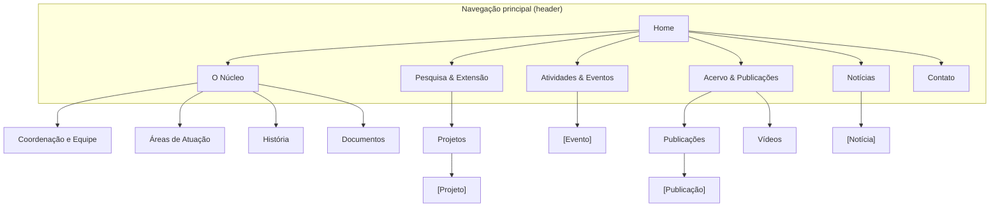

# NEAB Unicamp — Arquitetura de Informação (Fase 2)

> Base: [CONHECIMENTO.md](CONHECIMENTO.md) + [IDENTIDADE-VISUAL.md](IDENTIDADE-VISUAL.md).
> Tipo de site: institucional / conteúdo híbrido (centro de pesquisa).
> Profundidade: 3 níveis. Idioma: português. Site novo (greenfield, sem URLs legadas).

## Princípios que guiam esta arquitetura
1. **Cartão de existência** — a Home resolve "o que é o NEAB?" em segundos, pra quem
   nunca ouviu falar. Tudo importante a ≤2 cliques.
2. **Público triplo** — academia / comunidade externa-movimento negro / parceiros.
   Linguagem acessível; sem jargão que exclua o não-acadêmico.
3. **Manutenção por equipe não-técnica** — o que muda com frequência
   (notícias, eventos, pessoas, projetos, publicações) é **conteúdo de CMS**, nunca
   código. Ver §6 (Modelo de Conteúdo) — é o coração do projeto.
4. **Começa enxuto, cresce** — núcleo novo, pouco conteúdo. Seções existem mesmo
   começando pequenas; o template aguenta crescimento sem rearquitetura.

---

## 1. Hierarquia de páginas (árvore)

```
Home (/)
├── O Núcleo (/o-nucleo)                      ← quem somos + missão (landing da seção)
│   ├── Coordenação e Equipe (/o-nucleo/equipe)
│   ├── Áreas de Atuação (/o-nucleo/areas-de-atuacao)
│   ├── História (/o-nucleo/historia)
│   └── Documentos (/o-nucleo/documentos)     ← deliberação de criação, regimento
├── Pesquisa & Extensão (/pesquisa)           ← linhas de pesquisa (landing)
│   └── Projetos (/pesquisa/projetos)
│       └── [Projeto] (/pesquisa/projetos/{slug})
├── Atividades & Eventos (/eventos)           ← agenda (próximos) + memória (passados)
│   └── [Evento] (/eventos/{slug})
├── Acervo & Publicações (/acervo)            ← landing do acervo
│   ├── Publicações (/acervo/publicacoes)
│   │   └── [Publicação] (/acervo/publicacoes/{slug})
│   └── Vídeos (/acervo/videos)
├── Notícias (/noticias)                      ← feed
│   └── [Notícia] (/noticias/{slug})
└── Contato (/contato)
```

Profundidade máxima: 3 níveis (ex. `/pesquisa/projetos/{slug}`). Tudo dentro da regra
dos 3 cliques.

---

## 2. Sitemap visual (Mermaid)



---

## 3. Mapa de URLs

| Página | URL | Pai | Local na nav | Prioridade | Dinâmica? |
|---|---|---|---|---|---|
| Home | `/` | — | Header (logo) | Alta | Parcial (destaques) |
| O Núcleo | `/o-nucleo` | Home | Header | Alta | Estática |
| Coordenação e Equipe | `/o-nucleo/equipe` | O Núcleo | Dropdown | Alta | **CMS** |
| Áreas de Atuação | `/o-nucleo/areas-de-atuacao` | O Núcleo | Dropdown | Média | Estática |
| História | `/o-nucleo/historia` | O Núcleo | Dropdown | Média | Estática |
| Documentos | `/o-nucleo/documentos` | O Núcleo | Dropdown | Baixa | **CMS** (arquivos) |
| Pesquisa & Extensão | `/pesquisa` | Home | Header | Alta | **CMS** |
| Projetos | `/pesquisa/projetos` | Pesquisa | Dropdown | Média | **CMS** |
| Projeto (detalhe) | `/pesquisa/projetos/{slug}` | Projetos | — | Média | **CMS** |
| Atividades & Eventos | `/eventos` | Home | Header | Alta | **CMS** |
| Evento (detalhe) | `/eventos/{slug}` | Eventos | — | Média | **CMS** |
| Acervo & Publicações | `/acervo` | Home | Header | Média | **CMS** |
| Publicações | `/acervo/publicacoes` | Acervo | Dropdown | Média | **CMS** |
| Publicação (detalhe) | `/acervo/publicacoes/{slug}` | Publicações | — | Baixa | **CMS** |
| Vídeos | `/acervo/videos` | Acervo | Dropdown | Baixa | **CMS** |
| Notícias | `/noticias` | Home | Header | Alta | **CMS** |
| Notícia (detalhe) | `/noticias/{slug}` | Notícias | — | Média | **CMS** |
| Contato | `/contato` | Home | Header (botão) | Alta | Estática |

Convenções de URL: minúsculas, hífens, sem barra final, slugs legíveis em PT,
sem datas no caminho (`/noticias/chamada-pesquisador` e não `/noticias/2026/05/...`).

---

## 4. Navegação

### Header (7 itens — no limite, monitorar)
`[Logo NEAB]` · O Núcleo ▾ · Pesquisa & Extensão ▾ · Atividades & Eventos ·
Acervo & Publicações ▾ · Notícias · **[Contato]** (botão, à direita)

- Dropdowns em: O Núcleo, Pesquisa & Extensão, Acervo & Publicações.
- "Contato" estilizado como botão (equivale ao CTA) — caminho pra parceria/visita.
- Se 7 itens pesarem no mobile/visual, plano B: fundir "Notícias" dentro de
  "Atividades & Eventos" como aba → cai pra 6. Decidir no protótipo.

### Footer (4 colunas)
- **O NEAB:** Quem somos · Equipe · História · Documentos
- **Pesquisa:** Linhas de pesquisa · Projetos · Publicações
- **Atividades:** Eventos · Notícias · Vídeos
- **Contato & Redes:** Endereço · E-mail · Telefone · Instagram · Linktree
- Rodapé: selo Unicamp/COCEN, link de acessibilidade, © NEAB.

### Breadcrumbs
Em todas as páginas L2+. Espelham a URL:
`Home > Pesquisa & Extensão > Projetos > [Nome do Projeto]`

---

## 5. Linkagem interna (hub-and-spoke)
- **Home = hub principal.** Puxa destaques de Notícias, Eventos e um teaser de "O Núcleo".
- **O Núcleo** linka pra Pesquisa (o que fazemos) e Equipe (quem faz).
- **Notícias/Eventos** referenciam Projetos e Pessoas citados (cross-section).
- **Publicações** linkam aos Projetos/autores de origem.
- Cada **Pessoa** lista seus projetos/publicações; cada **Projeto** lista equipe e produções.
- Regra: **zero páginas órfãs** — toda página tem ≥1 link interno apontando pra ela
  (via nav, footer, breadcrumb ou conteúdo).

---

## 6. Modelo de conteúdo (o que o CMS precisa gerenciar)
> Este é o requisito que mais define a tecnologia. A equipe não-técnica edita estes
> tipos; o resto é página estática.

| Tipo (coleção) | Campos principais | Alimenta |
|---|---|---|
| **Notícia** | título, data, capa, resumo, corpo (rich text), categoria, destaque(s/n) | /noticias, Home |
| **Evento** | título, data/hora, local, capa, descrição, link de inscrição, status (próximo/passado) | /eventos, Home |
| **Pessoa** | nome, função, foto, mini-bio, Lattes/ORCID/Scholar, categoria (coordenação/pesquisador/equipe/colaborador) | /o-nucleo/equipe, projetos |
| **Linha de pesquisa** | título, descrição, área (Artes/Bio/Exatas/Humanas/Saúde/Tec) | /pesquisa |
| **Projeto** | título, descrição, coordenação (→Pessoa), linha (→Linha), status | /pesquisa/projetos |
| **Publicação** | título, autores, ano, tipo, link/PDF, resumo | /acervo/publicacoes |
| **Vídeo** | título, embed (YouTube), descrição | /acervo/videos |
| **Documento** | título, arquivo (PDF), categoria | /o-nucleo/documentos |
| **Página estática** | título, corpo (rich text) | Sobre, História, Áreas |

Páginas **estáticas** (raramente mudam, podem ser conteúdo fixo ou rich-text editável):
Home (estrutura), O Núcleo (quem somos), Áreas de Atuação, História, Contato.

---

## 7. Wireframe textual da Home (cartão de existência)
1. **Header** + nav.
2. **Hero** — logo/nome + frase de existência ("Núcleo de Estudos Afro-Brasileiros
   da Unicamp — pesquisa, extensão e ações afirmativas sobre a população
   afro-brasileira") + 1 CTA (conhecer o núcleo) sobre fundo na paleta quente.
3. **O que é o NEAB** — 2-3 linhas + atalhos pras áreas de atuação.
4. **Em destaque** — últimas Notícias (3) e próximos Eventos (2-3) [CMS].
5. **Pesquisa & Extensão** — teaser das linhas/projetos.
6. **Acervo/Publicações** — teaser (some se vazio).
7. **Rodapé** — contato, redes, selos Unicamp/COCEN, acessibilidade.

---

## 8. Acessibilidade (requisito de base — universidade pública)
- Contraste AA mínimo (atenção: terracota sobre creme precisa de teste; pode exigir
  escurecer o terracota pra texto).
- Controles de tamanho de fonte e alto contraste (padrão dos sites Unicamp/COCEN).
- Navegação por teclado, alt text em imagens, hierarquia semântica de headings.
- Selos institucionais Unicamp/COCEN no rodapé (confiança + pertencimento).

---

## Pendências antes do v1 de código
- [ ] Validar este mapa com o NEAB (coordenação/amiga).
- [ ] Decidir stack/CMS à luz do §6 e da infra (quando souber a hospedagem).
- [ ] Reunir conteúdo real mínimo (equipe, 1-2 linhas de pesquisa, eventos passados).
- [ ] Conseguir arquivos oficiais da identidade visual (refina IDENTIDADE-VISUAL.md).
